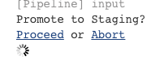
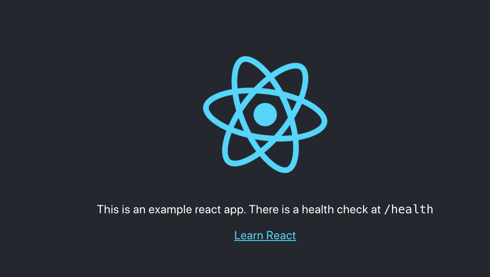

# react-app-scafoold

A kick starter for a React Application which adds on to what is generated by `create-react-app`

## What's in the box

- Basic create-react-app template
- Opinionated linting framework
- react-router with *really* basic example
- A Jenkins pipeline which does the following:
  - Tests and lints the code
  - Builds and deploys the app in OpenShift dev environment
  - Allows promotion to a staging environment

## Getting the app deployed

1. Create 3 projects and the pipeline build by running *(MAKE SURE TO REPLACE <YOUR_NAME> first)*:
```sh
oc process -f .openshift-apply/setup.yml -p APP_NAME=react-app-scaffold \
-p SOURCE_REPOSITORY_URL=https://github.com/Tompage1994/react-app-scaffold.git \
-p NAMESPACE_BASE=<YOUR_NAME> | oc create -f -
```

2. Deploy Jenkins in `<YOUR_NAME>-ci-cd` from the catalog. Provide at least 10Gi for the volume size

3. run `oc start-build react-app-scaffold-pipeline -n <YOUR_NAME>-ci-cd`. Go to Jenkins and follow the logs. Once recieving the following message ensure the app has deployed on the dev route (url shown in logs)


4. Once satistfied with the deployment, click to proceed. Wait for the deployment to finish then go the staging application and see it has deployed.


## Improvements
This scaffold application is not yet finished and still requires some improvements. See issues for ideas